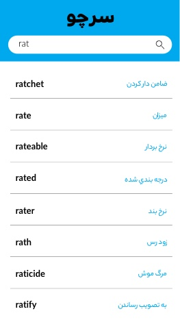

# trie data sturcuture

This is a little project for data structure students

## 💾 Table of contents

- [Dictinery with trie data sturcuture](#dictinery-with-trie-data-sturcuture)
  - [💾 Table of contents](#💾-table-of-contents)
  - [⛩About](#⛩about)
  - [🎯Parts of solution](#🎯parts-of-solution)
    - [🎗Hint](#🎗hint)
  - [🔗 Links](#🔗-links)
  - [⭐️Additional score](#⭐️additional-score)
  - [📦Data](#📦data)

## ⛩About

we want to make a straightforward English to Persian dictionary that uses the trie data structure for saving data and finding them.



## 🎯Parts of solution

First of all, you have to add words in the JSON file to a **trie Data structure** .then you should use a listener on your input text-box whenever somebody adds a letter you have to move on trie tree and print nearest nodes that their isEndOfWord flag is true.

🚨 Alert: using 3rd-party libraries is not allowed.

```json
[
  {
    "english": "a few",
    "farsi": "کمي"
  },
  {
    "english": "a great deal of",
    "farsi": "يک دنيا"
  },
  {
    "english": "a handful",
    "farsi": "يک مشت"
  },
  {
    "english": "a la garconne",
    "farsi": "آلاگارسن"
  }
  //...
]
```

### 🎗Hint

All of them are exactly like a simple trie tree. You need to add a variable for saving the meaning of the word if its isEndOfWord flag is true.

## 🔗 Links

[https://en.wikipedia.org/wiki/Trie](https://en.wikipedia.org/wiki/Trie)

[https://www.geeksforgeeks.org/trie-insert-and-search/](https://www.geeksforgeeks.org/trie-insert-and-search/)

## ⭐️Additional score

add persian to english dictionary [ ]

## 📦Data

the data you need to work on is accessible in two JSON and CSV format.

[Data.zip](https://github.com/parsamoh/DS-dictionary/raw/master/data.zip)
